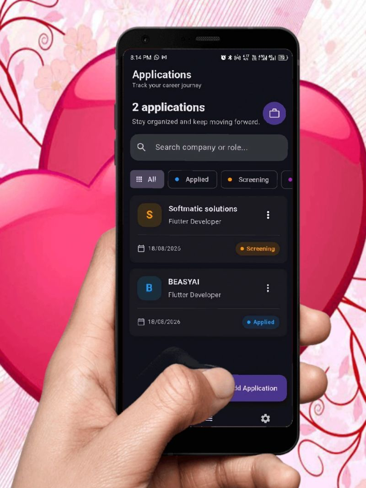
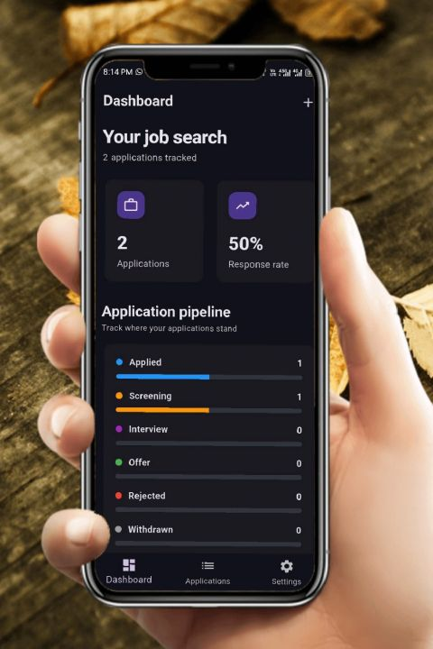
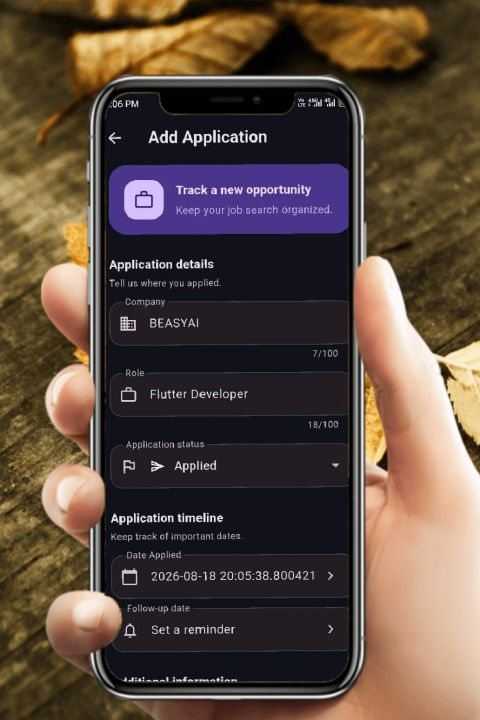
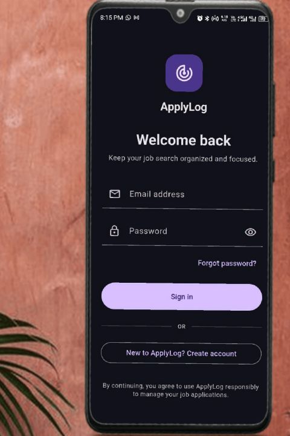

# ApplyLog

A job application tracker built with Flutter, Firebase, and real-time Firestore streams — built to solve a real, current problem: tracking every job application, its status, and follow-ups, instead of losing track across scattered notes.

## Screenshots

| Application List | Dashboard | Add Application | Login |
|---|---|---|---|
|  |  |  |  |

## Features

- [x] Real-time application list synced via Firestore `.snapshots()` — updates live, no manual refresh
- [x] Status pipeline: Applied → Screening → Interview → Offer → Rejected → Withdrawn
- [x] Debounced search and status filter chips, composed via Riverpod providers
- [x] Firebase Authentication with auth-based routing redirect (go_router)
- [x] Follow-up reminder notifications via `flutter_local_notifications`, with swipeable bottom navigation and custom app/notification icons
- [x] Dashboard with response rate, total applications, and status breakdown — all derived from the same live stream, no duplicate fetches
- [x] Delete with confirmation dialog
- [x] Dark mode
- [x] Bottom navigation via `StatefulShellRoute`, preserving tab state, with swipe-to-switch between tabs
- [x] Empty and error states throughout
- [x] Battery optimization exemption request for improved notification reliability

## Architecture

Feature-first Clean Architecture, same pattern used across all layers:
lib/
│
├── core/
│ │
│ ├── errors/
│ │ └── Failure and Result sealed classes
│ │ └── Compile-time enforced error handling
│ │
│ ├── router/
│ │ ├── go_router configuration, auth-aware redirects
│ │ └── Swipeable StatefulShellRoute wrapper
│ │
│ ├── theme/
│ │ └── Dark mode theme provider
│ │
│ ├── notifications/
│ │ ├── domain/
│ │ │ ├── repositories/notification_repository.dart
│ │ │ └── usecases/schedule_follow_up_reminder.dart
│ │ ├── data/
│ │ │ └── local_notification_service.dart
│ │ └── presentation/providers/
│ │
│ └── utils/
│ └── Shared status color and date formatting utilities
│
├── features/
│ │
│ ├── auth/
│ │ ├── data/FirebaseAuthRepositoryImpl
│ │ ├── domain/AuthRepository interface
│ │ └── presentation/Login, Signup, auth state provider
│ │
│ ├── applications/
│ │ ├── data/ApplicationModel, Firestore repository implementation
│ │ ├── domain/Application entity, ApplicationRepository interface
│ │ └── presentation/List, Detail, Add screens, search/filter providers
│ │
│ ├── dashboard/
│ │ └── presentation/Statistics screen
│ │
│ └── settings/
│ └── presentation/Settings screen, notification & battery permission prompts
│
└── main.dart


**Key architectural decisions:**

- **Real-time over one-time fetches.** `ApplicationRepository.watchApplications()` returns `Stream<Result<List<Application>>>`, wrapping Firestore's live `.snapshots()` — the UI updates automatically when data changes, with no manual refresh calls anywhere in the app.
- **Provider composition over widget-local state.** Search and status filtering are implemented as composed Riverpod providers (`filteredApplicationsProvider` watches the live stream + filter state together) rather than local `setState()`. The Dashboard's stats are derived from the exact same underlying stream with zero duplicate Firestore reads.
- **A real Use Case, added when it earned its complexity.** Most operations (add/update/delete) call the repository interface directly from the presentation layer — deliberately, since there's no business logic to isolate for simple CRUD. `ScheduleFollowUpReminder` is the one place a formal Use Case was introduced, because scheduling a reminder involves real orchestration (permission requests + notification scheduling) that benefits from being centralized.
- **Deterministic notification IDs.** Firestore document IDs are strings; Android notification IDs must be positive 32-bit integers. A custom polynomial hash (not Dart's built-in `String.hashCode`, which isn't guaranteed identical across compilation targets) converts one to the other deterministically, so the same application always maps to the same notification ID.

## Known Issue — Notification Delivery on Killed App State

Follow-up reminders are fully functional and verified while the app is in the foreground or backgrounded — confirmed on real hardware (Tecno, Infinix). When the app process is fully killed, delivery becomes unreliable on some Transsion HiOS-based devices.

Debugging process: scheduling was confirmed correct at the OS level via `pendingNotificationRequests()`, and delivery in foreground/background was fixed by explicitly declaring `ScheduledNotificationReceiver` in the manifest (not auto-merged correctly in this project's build). To isolate whether the remaining killed-state issue was app-specific or platform-specific, I cloned and ran the official `flutter_local_notifications` example app on the same hardware — it exhibited the same limitation, confirming this is a known Android OEM constraint (aggressive process termination on HiOS), not an implementation bug. Documented here rather than hidden, as an example of isolating a bug down to its actual root cause instead of guessing indefinitely.

## Tech Stack

- **State Management:** Riverpod — `StreamProvider` for live auth/data watching, composed `Provider`s for derived state, `Notifier` for simple synchronous state (theme)
- **Backend:** Firebase (Authentication, Firestore)
- **Routing:** go_router — auth-aware redirect, `StatefulShellRoute` with swipeable bottom navigation
- **Notifications:** flutter_local_notifications, timezone-aware exact scheduling, explicit manifest receiver configuration
- **Error Handling:** Sealed `Result`/`Failure` pattern, enforcing compile-time handling of success/error cases

## Getting Started

```bash
flutter pub get
flutterfire configure   # connect your own Firebase project
flutter run
```

## What I Learned Building This

Beyond extending REST-based Clean Architecture patterns into a Firebase, real-time context, the most valuable part of this project was a genuine debugging investigation: isolating a silent notification-delivery failure by comparing my implementation against an unmodified reference app on identical hardware, rather than guessing at fixes. That process — narrowing "it doesn't work" down to a specific, verifiable root cause — mattered more than the fix itself.